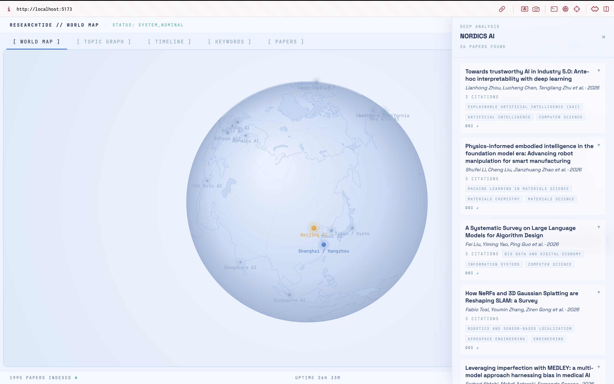
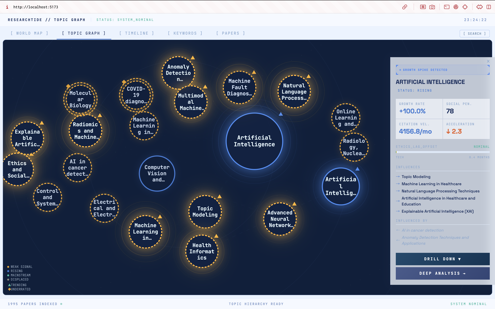
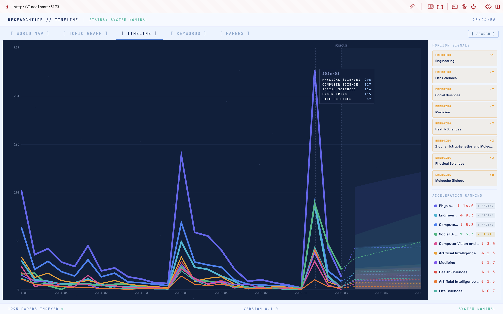
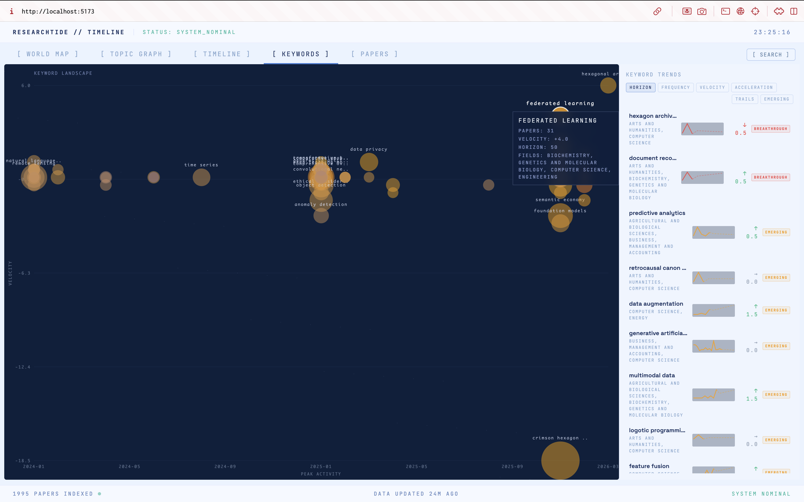
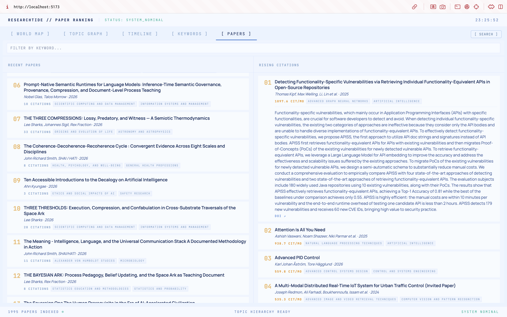

<div align="center">

# ResearchTide

### Predict the future of science from within.

*A multi-agent system that maps research trends, detects weak signals, and forecasts where science is heading — by analyzing the living dynamics of academic literature.*

[](LICENSE)
[](CONTRIBUTING.md)
[](https://github.com/generalLiebe/researchtide)

**[White Paper (Japanese)](docs/whitepaper_ja.md)** · **[UI Spec](docs/UI_SPEC.md)** · **[Contributing](CONTRIBUTING.md)**

</div>

---

## Screenshots



| Topic Graph | Timeline |
|:---:|:---:|
|  |  |

| Keywords | Papers |
|:---:|:---:|
|  |  |

---

## What is ResearchTide?

Existing tools like VOSviewer and Semantic Scholar are excellent at visualizing the *past* — citation networks, keyword co-occurrence, author collaboration. But none of them answer the question researchers actually care about:

> **"Where is this field going, and how fast?"**

ResearchTide monitors the living dynamics of academic literature — growth rates, cross-disciplinary propagation, and technology displacement — to surface emerging research trends before they go mainstream.

Think of it as **Horizon Scanning, made computational.**

---

## Core Features

| Feature | Description |
|---|---|
| **Weak Signal Detection** | Identifies topics whose citation velocity is accelerating before they go mainstream |
| **Keyword Trend Analysis** | Tracks technical terms over time with velocity, acceleration, and forecast |
| **Cross-field Propagation** | Maps how concepts travel across disciplines (e.g. NLP → Biology) |
| **Horizon Scoring** | Scores and classifies topics as Watch / Emerging / Breakthrough |
| **Timeline Forecasting** | Statistical forecasting of publication volume per category |
| **Live Dashboard** | Real-time React dashboard with multiple analysis views |

---

## Dashboard Tabs

| Tab | What it shows |
|-----|---------------|
| **World Map** | Geographic distribution of research institutions |
| **Topic Graph** | Interactive network of research hubs and topic relationships |
| **Timeline** | Monthly publication trends per category with acceleration and forecast |
| **Keywords** | Top technical terms with velocity, horizon score, and emerging flag |
| **Papers** | Searchable paper list with filtering by hub, topic, keyword, author |

---

## Quick Start

### Prerequisites

- Python 3.11+
- Node.js 18+

### 1. Backend

```bash
git clone https://github.com/generalLiebe/researchtide.git
cd researchtide

python -m venv .venv
source .venv/bin/activate  # Windows: .venv\Scripts\activate
pip install -e ".[dev,viz]"

cp .env.example .env
# Optional: add S2_API_KEY and OPENALEX_EMAIL for richer data

uvicorn researchtide.api.main:app --reload --port 8000
```

### 2. Dashboard (separate terminal)

```bash
cd dashboard
npm install
npm run dev
```

### 3. Open http://localhost:5173

The background scheduler automatically fetches papers from OpenAlex after ~2 minutes. All dashboard tabs will populate as data arrives.

### Environment Variables

| Variable | Description | Default |
|----------|-------------|---------|
| `S2_API_KEY` | Semantic Scholar API key ([get one free](https://www.semanticscholar.org/product/api#api-key-form)) | *(none)* |
| `OPENALEX_EMAIL` | Email for OpenAlex polite pool (higher rate limits) | *(none)* |
| `RESEARCHTIDE_CORS_ORIGIN` | Allowed CORS origins | `http://localhost:5173` |
| `DASHBOARD_CACHE_TTL` | Cache TTL in seconds | `21600` (6h) |

---

## How It Works

```
Data Ingestion     arXiv · Semantic Scholar · OpenAlex
Topic Analysis     BERTopic · Citation graph · Keyword time-series
Weak Signal        Anomaly detection on citation velocity
Horizon Scanning   Cross-field propagation · Emergence scoring
Forecasting        Statistical forecast (statsmodels) per category/keyword
Dashboard          React · Recharts · FastAPI
```

Data flows from OpenAlex into a local cache, which is processed into multiple analysis views: topic graphs, keyword trends, horizon alerts, and timeline forecasts. A background scheduler keeps the data fresh.

---

## Tech Stack

```
Backend      Python 3.11+ · FastAPI · Pydantic v2
NLP          BERTopic · sentence-transformers
Graphs       NetworkX
Forecasting  statsmodels · scikit-learn · NumPy
Frontend     React · TypeScript · Recharts · Tailwind CSS
Deployment   Docker · Render (API) · Vercel (Dashboard)
```

---

## Project Structure

```
researchtide/
  src/researchtide/
    api/            # FastAPI endpoints and live dashboard logic
    analysis/       # Citation velocity, keyword trends, forecasting
    detection/      # Weak signal and horizon score detection
    graph/          # Influence graph construction
    ingestion/      # arXiv, OpenAlex, Semantic Scholar connectors
    models/         # Pydantic data models
  dashboard/        # React + TypeScript frontend
  tests/            # Test suite
  scripts/          # Data refresh utilities
  docs/             # White paper, UI spec
```

---

## Research Questions

ResearchTide is simultaneously an OSS engineering project and a research project:

- **RQ1** — Can citation dynamics at time *t* predict high-impact topics at *t+2*?
- **RQ2** — Are technology displacement events (GAN→Diffusion, LSTM→Transformer) predictable from citation signals?
- **RQ3** — Does a self-correcting feedback loop measurably improve prediction accuracy over time?

---

## Roadmap

| Phase | Timeline | Milestones |
|---|---|---|
| **v0.1 — Foundation** | Apr–Jun 2026 | Data pipeline, topic analysis, dashboard, public release |
| **v0.2 — Agents** | Jul–Sep 2026 | Multi-agent simulation, LLM forum, social tracking |
| **v0.3 — Feedback** | Oct–Dec 2026 | Self-correcting feedback loop, retrospective validation |
| **v1.0 — Paper** | 2027 Q1 | Academic paper submission, interactive public demo |

---

## Contributing

Contributions are welcome! Areas where help is especially needed:

- **Data connectors** — PubMed, IEEE Xplore, ACL Anthology, DBLP
- **Dashboard components** — New visualization views, UX improvements
- **Evaluation benchmarks** — Historical datasets for retrospective validation
- **Translations** — Making the project accessible beyond English
- **Testing** — Expanding test coverage

See [CONTRIBUTING.md](CONTRIBUTING.md) for setup instructions and guidelines.

---

## Docs

- [White Paper (Japanese)](docs/whitepaper_ja.md)
- [UI Design Specification](docs/UI_SPEC.md)

---

## Author

**Sosui Moribe**
Graduate School of Design, Kyushu University
moribe.sosui.695@s.kyushu-u.ac.jp

---

<div align="center">

*If this project resonates with you, a star means a lot.*

</div>
